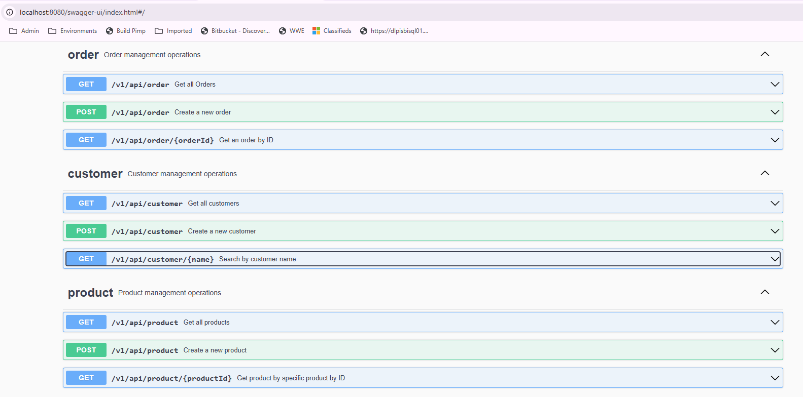
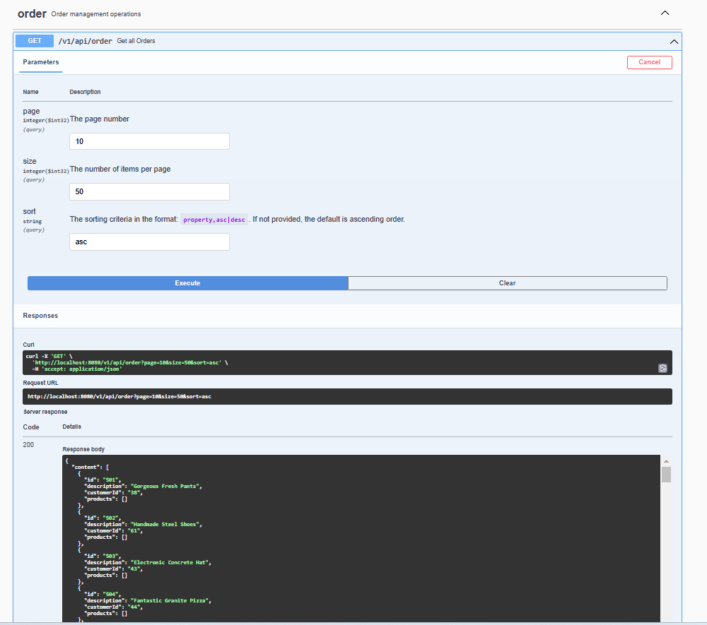

# Online Store API 🛒

## Overview

This project is a **Spring Boot-based REST API** for managing an online store. It handles core functionalities such as **order management**, **customer search**, and **product management**. The API is optimized for performance and can scale to handle large volumes of data efficiently. Pagination and advanced database optimizations ensure fast response times even with large datasets.

## Features Implemented 🌟

### Core Features

#### Order Management
- Retrieve all orders with **pagination** support.
- Retrieve a specific order by **ID**.
- Include **product details** in the order response.

#### Customer Search
- Find customers by matching a **query string** with any word in their name.

#### Product Management
- Create new products via a **POST** endpoint.
- Retrieve all products or get a specific product by **ID**.
- Return a list of **order IDs** where each product appears.

### Performance Optimizations 🚀
- **Spring Pageable** to paginate large responses, improving response times.
- Optimized database queries to minimize latency between the **database** and the **application server**.
- Ensured **indexes** on frequently queried database columns.

### Docker & CI/CD 🐳⚙️
- Built a **Docker image** to streamline deployment.
- Integrated **PostgreSQL** with a `docker-compose.yml` file for easy setup.
- Implemented a **CI/CD pipeline** for automating build, test, and deployment processes.

### Clone from GitHub
   ```bash
   https://github.com/veejaymee/store.git
   ```

## API Endpoints 📡

### Order Endpoints
- `GET /v1/api/order` – Retrieve all orders (paginated).
- 
- `GET /v1/api/order/{orderId}` – Retrieve a specific order by ID.
- 
- `POST /v1/api/order` – Create new Order.
- 

### Customer Endpoints
- `GET /v1/api/customer` – Retrieve customers.
- 
- `POST /v1/api/customer` – Create new Customer.
- 
- `GET /v1/api/customer/{name}` – Search by Customer Name.
- 

### Product Endpoints
- `POST /v1/api/product` – Create a new product.
- 
- `GET /v1/api/product` – Retrieve all products.
- 
- `GET /v1/api/product/{productId}` – Retrieve a specific product by ID, including the orders it appears in.
- 

## Running the Application 🏃‍♂️

### Using Docker

1. **Build the Docker image:**
   ```bash
   docker build -t store .
   ```

2. **Run the application with PostgreSQL using Docker Compose:**
   ```bash
   docker-compose up
   ```

### Without Docker

1. Ensure **PostgreSQL** is running and properly configured.
2. Update `application.yml` with your database connection details.
3. Run the application using Gradle:
   ```bash
   ./gradlew bootRun
   ```

## CI/CD Pipeline ⚡

- The pipeline automatically **builds**, **tests**, and **deploys** the application as a Docker container.
- The **docker-compose.yml** file ensures the PostgreSQL database runs alongside the API in a containerized environment.

## Future Improvements 🚧

- Implement **caching** for frequently accessed data to reduce database load.
- Improve database **indexing** further to optimize query performance.
- Add **authentication and authorization** to secure sensitive endpoints.


---

Feel free to contribute or provide feedback! 🚀
